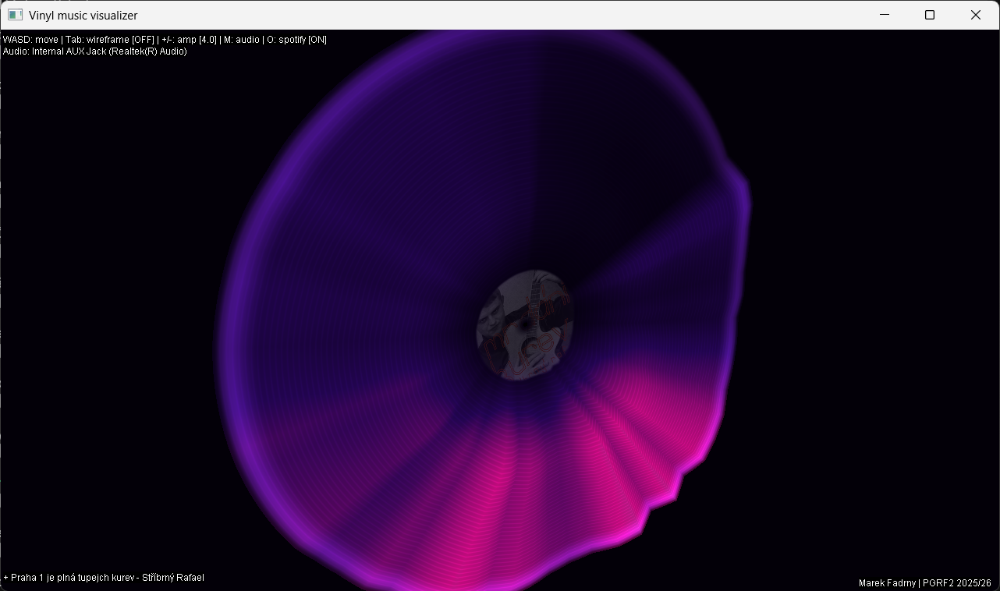

# Vinyl Audio Visualizer

An interactive 3D audio-reactive music visualizer currently being rewritten in **Rust**.

The application captures real-time audio streams (via your microphone or system loopback) and applies a Fast Fourier Transform (FFT) to deform the topography of a 3D polar circular grid resembling a classic vinyl record. In addition, it integrates with the **Spotify Web API** using the secure OAuth PKCE flow to dynamically pull currently playing track information and map the active song's album art directly onto the rotating vinyl's label.



---

## Features

*   **Interactive 3D Polar Topography**: Vertices of a circular grid are displaced along the Y-axis using logarithmic frequency mappings, creating natural-looking acoustic ripples.
*   **Procedural OpenGL Shading**: Custom vertex and fragment shaders render realistic vinyl grooves, edge reflections, center hole masking, and ambient breathing waves when silent.
*   **Logarithmic Amplitude Coloring**: 4-stop color gradient (indigo ➔ magenta ➔ cyan ➔ white) mapped dynamically to the vertex height.
*   **Spotify Integration**: Secure authentication callback server running on `http://127.0.0.1:8888/callback`. Pulls active track metadata and maps album art as a dynamic 2D OpenGL texture directly onto the center label.
*   **On-the-fly Input Selection**: Cycle through available recording lines (Microphone, Stereo Mix, etc.) in real-time.

---

## Controls

| Key / Input | Action |
| :--- | :--- |
| **`W` / `S` / `A` / `D`** | Move camera (Forward / Backward / Left / Right) |
| **Mouse Left-Click + Drag** | Rotate camera (Azimuth / Zenit) |
| **`Tab`** | Toggle Wireframe / Solid fill rendering |
| **`+` / `-`** (or `=`) | Increase / Decrease audio gain (deformation height) |
| **`M`** | Cycle through available audio input devices (e.g. Stereo Mix, Mic) |
| **`O`** | Toggle Spotify Connection (triggers OAuth in your browser) |
| **`Escape`** | Close the application |

---

## Prerequisites

*   **Rust Toolchain**: Install via [rustup](https://rustup.rs/) (stable channel).
*   **Cargo**: Bundled with Rust and used to build/run the rewrite baseline.
*   **Audio Source**: Working system audio with recording capability.

---

## How to Enable System Loopback (Stereo Mix)

By default, Java's `AudioSystem` listens to your recording devices. To visualize music played on your computer (e.g., Spotify client, YouTube, media player) rather than room sound through your microphone, you must enable a loopback recording device.

### Windows Setup (Stereo Mix)
1.  **Open Sound Settings**: Right-click the Speaker/Volume icon in your taskbar and select **Sounds** (or navigate to *Settings* ➔ *System* ➔ *Sound* ➔ *More sound settings*).
2.  **Show Hidden Devices**: Go to the **Recording** tab. Right-click on empty white space in the list and ensure both **Show Disabled Devices** and **Show Disconnected Devices** are checked.
3.  **Enable Stereo Mix**: Look for **Stereo Mix** (sometimes called *What U Hear* or *Wave Out Mix*). Right-click it and choose **Enable**.
4.  **Set as Default**: Right-click it again and choose **Set as Default Device** (or cycle to it inside the visualizer using the **`M`** key).
5.  **Microphone Privacy**: Make sure Windows privacy settings permit apps to access your microphone.

---

## Spotify Integration Setup

To fetch live cover art and track metadata, you need to provide your own Spotify Developer credentials.

1.  Log in to the [Spotify Developer Dashboard](https://developer.spotify.com/dashboard).
2.  Click **Create App** and fill in the details:
    *   **App Name**: `Vinyl Visualizer`
    *   **Redirect URI**: `http://127.0.0.1:8888/callback` *(Must match exactly!)*
3.  Go to the settings of your newly created Spotify app and copy the **Client ID**.
4.  In the root folder of this project (next to `pom.xml`), create a new file named **`spotify.properties`**.
5.  Add your Client ID to the file using this exact key:
    
    ```properties
    spotify.client_id=YOUR_SPOTIFY_CLIENT_ID_HERE
    ```

---

## Building & Running

Build and run the Rust rewrite baseline with:

```bash
cargo run
```

Legacy Java implementation is still available in `src/main/java` while the rewrite progresses.

---

## Third-Party Libraries & Licensing

This project utilizes several external libraries that are included in this repo for convenience. Please note that:
*   **LWJGL 3 (Lightweight Java Game Library)** is distributed under the [BSD License](https://www.lwjgl.org/license).
*   The following external libraries are used for academic/educational purposes:
    *   [transforms](https://gitlab.com/honza.vanek/transforms) (by Jan Vaněk)
    *   [lwjgl-utils](https://gitlab.com/Bruno.Jezek/lwjgl-utils) (by Bruno Ježek)
    
    These educational libraries are **not** part of my custom project source code. Any use, distribution, or modification of these libraries is governed strictly by their respective author's licenses and academic guidelines.

---

*Developed by Marek Fadrný | FIM UHK PGRF2 2025/26*

*While working on this project, coding assisting tools leveraging LLMs were used - namely GitHub Copilot and GitHub Copilot Chat*
